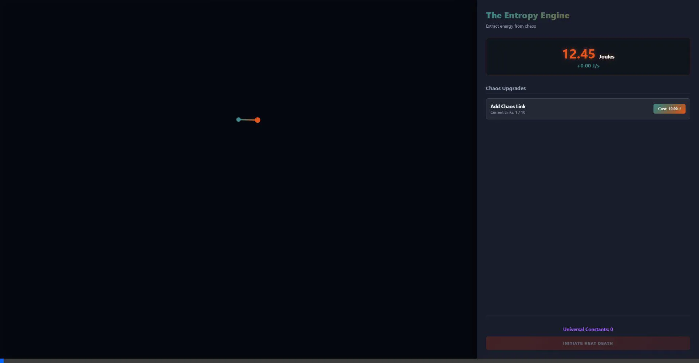

# The Entropy Engine

An active, physics-based incremental idle game built entirely in Vanilla Javascript and HTML5 Canvas. 

Rather than arbitrary numbers ticking up, **The Entropy Engine** generates currency (Joules) derived directly from the exact mathematical Kinetic Energy of a simulated N-link chaotic pendulum!

## Gameplay Mechanics

* **The Joule Economy:** Drag and "slingshot" the pendulum bobs across the screen to inject massive bursts of angular momentum into the system. The total kinetic energy calculated per-frame by the Runge-Kutta physics integrator dictates your Joule generation rate.
* **Chaos Links:** Spend Joules in the shop to add more links to your pendulum (up to a hard cap of 10). Each new link drastically increases the angular velocity and chaotic nature of the system, sending your energy generation into overdrive.
* **Prestige System:** (Coming Soon) Initiate Heat Death to collapse the universe and harvest Universal Constants to permanently upgrade your physics multipliers.

## Gameplay Demo
Watch the slingshot mechanics and Joule economy in action:

